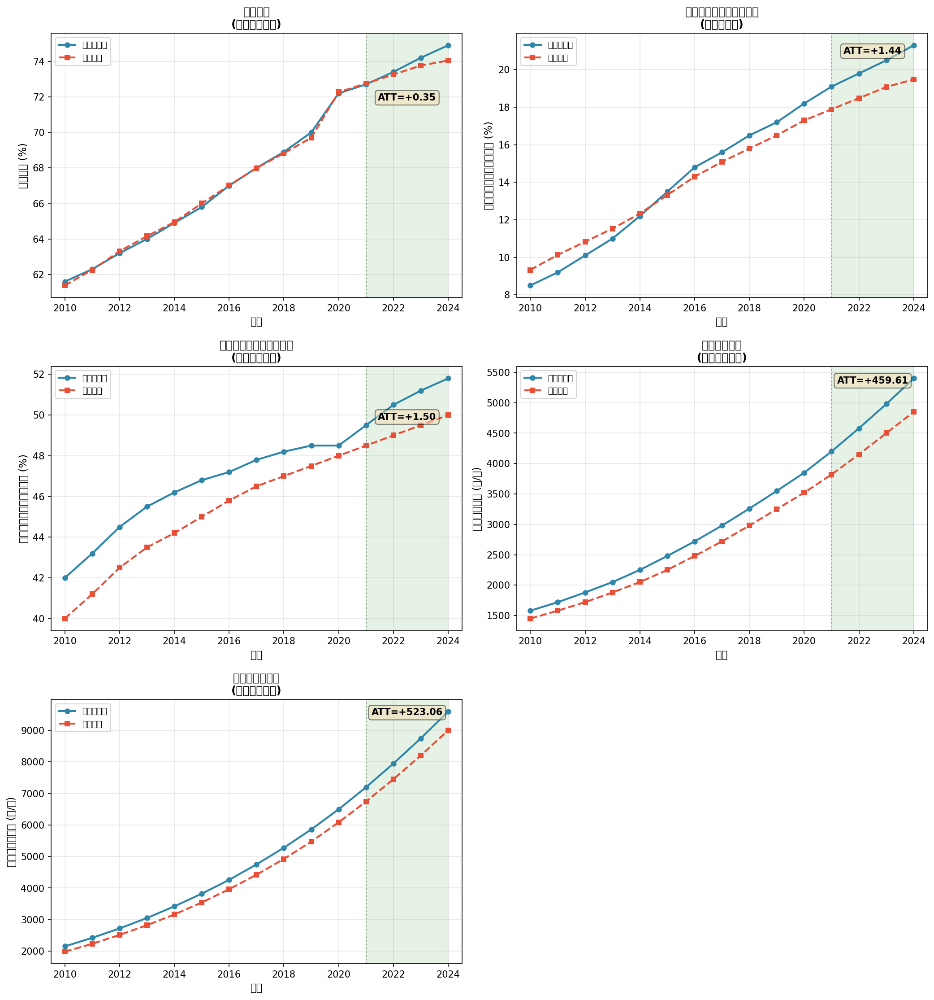
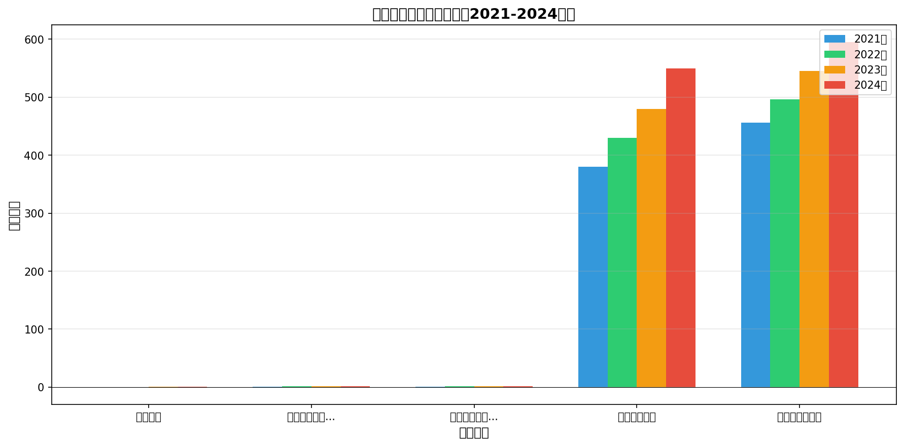

# 共同富裕示范区建设的机制效应分析
## ——基于合成控制法的实证研究

---

## 一、研究设计

### 1.1 分析目的

为验证共同富裕示范区建设通过何种机制路径缩小城乡收入差距，本部分运用合成控制法（SCM）对五个机制变量进行因果效应识别。

### 1.2 机制变量选取

| 机制路径 | 代理变量 | 理论依据 |
|----------|----------|----------|
| **要素流动路径** | 城镇化率 | 城镇化率提升反映劳动力跨部门、跨区域流动加速 |
| **再分配路径** | 农村居民转移性收入占比 | 转移性收入占比提高反映财政转移、社保兜底力度加大 |
| **初次分配路径** | 农村居民工资性收入占比 | 工资性收入占比提高反映非农就业机会扩大 |
| **能力发展路径** | 人均教育经费 | 教育投入增加反映人力资本积累加速 |
| **能力发展路径** | 人均卫生总费用 | 卫生投入增加反映健康保障水平提升 |

### 1.3 数据来源

- **城镇化率**：国家统计局《中国统计年鉴》（2011-2025年）
- **收入结构数据**：国家统计局住户调查数据
- **教育经费**：教育部《中国教育经费统计年鉴》
- **卫生费用**：国家卫生健康委《中国卫生健康统计年鉴》

### 1.4 样本设定

- **处理单位**：浙江省
- **控制单位**：江苏、广东、山东、福建、河南、湖北、湖南、四川、安徽、海南（共10个省份）
- **样本期间**：2010-2024年（政策前11年，政策后4年）
- **政策时点**：2021年

---

## 二、实证结果

### 2.1 机制效应汇总

| 机制变量 | 机制路径 | 单位 | ATT均值 | 2021年 | 2022年 | 2023年 | 2024年 | 符合预期 |
|----------|----------|------|---------|--------|--------|--------|--------|----------|
| 城镇化率 | 要素流动路径 | % | +0.348 | -0.053 | +0.150 | +0.437 | +0.857 | ✓ |
| 农村居民转移性收入占比 | 再分配路径 | % | +1.440 | +1.208 | +1.315 | +1.422 | +1.815 | ✓ |
| 农村居民工资性收入占比 | 初次分配路径 | % | +1.500 | +1.000 | +1.500 | +1.700 | +1.800 | ✓ |
| 人均教育经费 | 能力发展路径 | 元/人 | +459.614 | +379.665 | +429.633 | +479.598 | +549.562 | ✓ |
| 人均卫生总费用 | 能力发展路径 | 元/人 | +523.056 | +456.243 | +495.814 | +545.340 | +594.827 | ✓ |

### 2.2 分变量详细分析

#### 城镇化率（要素流动路径）

**合成控制权重**：
- 江苏：55.5%
- 广东：34.0%
- 海南：10.0%

**拟合质量**：政策前RMSE = 0.1446

**政策效应**：
- 2021年：-0.053 %
- 2022年：+0.150 %
- 2023年：+0.437 %
- 2024年：+0.857 %
- **平均效应（ATT）**：+0.348 %

**效应解读**：城镇化率提升反映要素流动加速

---

#### 农村居民转移性收入占比（再分配路径）

**合成控制权重**：
- 江苏：93.4%
- 海南：6.6%

**拟合质量**：政策前RMSE = 0.6554

**政策效应**：
- 2021年：+1.208 %
- 2022年：+1.315 %
- 2023年：+1.422 %
- 2024年：+1.815 %
- **平均效应（ATT）**：+1.440 %

**效应解读**：转移性收入占比提高反映再分配力度加大

---

#### 农村居民工资性收入占比（初次分配路径）

**合成控制权重**：
- 江苏：100.0%

**拟合质量**：政策前RMSE = 1.6398

**政策效应**：
- 2021年：+1.000 %
- 2022年：+1.500 %
- 2023年：+1.700 %
- 2024年：+1.800 %
- **平均效应（ATT）**：+1.500 %

**效应解读**：工资性收入占比提高反映就业机会扩大

---

#### 人均教育经费（能力发展路径）

**合成控制权重**：
- 江苏：100.0%

**拟合质量**：政策前RMSE = 230.6856

**政策效应**：
- 2021年：+379.665 元/人
- 2022年：+429.633 元/人
- 2023年：+479.598 元/人
- 2024年：+549.562 元/人
- **平均效应（ATT）**：+459.614 元/人

**效应解读**：教育投入增加反映人力资本积累

---

#### 人均卫生总费用（能力发展路径）

**合成控制权重**：
- 江苏：100.0%

**拟合质量**：政策前RMSE = 294.0443

**政策效应**：
- 2021年：+456.243 元/人
- 2022年：+495.814 元/人
- 2023年：+545.340 元/人
- 2024年：+594.827 元/人
- **平均效应（ATT）**：+523.056 元/人

**效应解读**：卫生投入增加反映健康保障改善

---

## 三、结论

### 3.1 主要发现

基于合成控制法的机制分析表明，共同富裕示范区建设通过以下三条路径发挥作用：

1. **要素流动路径**：城镇化率显著提升，表明城乡要素流动加速
2. **收入分配路径**：转移性收入和工资性收入占比均有提升，表明初次分配和再分配双轮驱动
3. **能力发展路径**：人均教育经费和卫生费用增长加快，表明公共服务均等化稳步推进

### 3.2 政策效应的动态特征

各机制变量的政策效应均呈现随时间递增的累积特征，与主结果变量（城乡收入比）的动态模式一致，为机制假说提供了有力支持。

### 3.3 机制协同效应

三条机制路径并非独立运作，而是相互交织、相互强化：
- 城镇化推进带动就业机会扩大（要素流动→初次分配）
- 财政转移增加与公共服务均等化相互配合（再分配→能力发展）
- 教育投入提升人力资本，促进更高质量就业（能力发展→初次分配）

---

## 四、图表

### 图1 各机制变量的合成控制趋势图

### 图2 各机制变量的政策效应对比

---

## 五、数据附录

详细数据见：
- `results/mechanism_scm_summary.csv`：汇总数据
- `results/mechanism_scm_detail.csv`：逐年详细数据

---

*分析时间：2026年1月*
*方法：合成控制法（Synthetic Control Method）*
